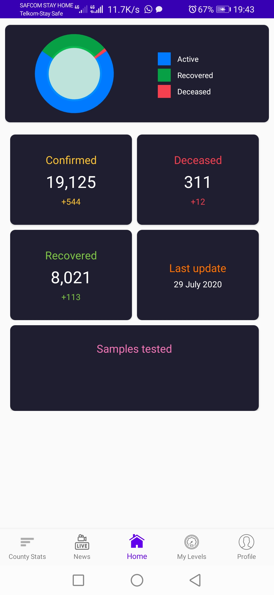
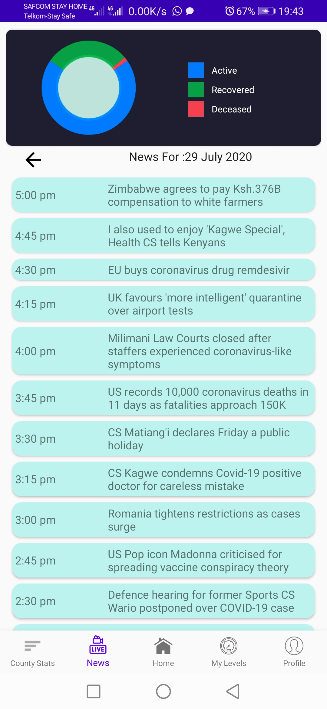

# ECovidApp Kenya

  
  
  
  
  

✨ An kenyan app-solution where all different scenarios and use-cases for health care professionals working in a COVID-19 environment can be covered and the public made aware of important information and government guidelines.

 *UNDER DEVELOPMENT*
 ### To-Do List

- [x] offer real-time statistics and information related to covid-19.
- [x] offer real-time news Related to Covid-19.
- [ ] remind the users on the preventive guidelines set by the government.
- [ ] Show covid 19 centers/isolation depending on your location.
- [ ] analyze users risk levels.
- [ ] classify the counties depending on the hot zones.

# ScreenShots
  .

